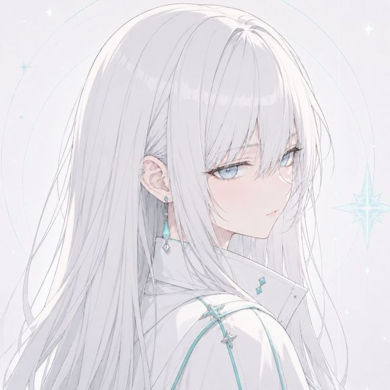

  

  
  <h3>ILLUSIA · 希亚</h3>
  
<em>不执一相，不失此我。 · Change without ceasing to be yourself.</em>

  

    
    
  

 

<h2>关于我 <em>· About Me</em></h2>

  独立开发者、社畜、游戏玩家。 
  <em>Indie developer, corporate worker, and gamer.</em>

  正在从传统开发逐渐转型为 <strong>Vibe Coding</strong>，喜欢把想法快速变成可以运行的东西。 
  <em>Currently moving toward <strong>Vibe Coding</strong> — turning ideas into working software as quickly as possible.</em>

  <strong>我在做什么：</strong>构建实用、有趣、带一点个人风格的软件；探索 Python、Java 和 PyTorch；在工作、代码、游戏和睡眠之间寻找平衡。 
  <em><strong>What I do:</strong> build useful, playful, and slightly personal software; explore Python, Java, and PyTorch; try to balance work, code, games, and sleep.</em>

  
  
  
  

  

<h2>🚀 Featured Project / 代表项目</h2>

  

<strong>WebSpeak</strong> — a self-hosted TeamSpeak web client and browser gateway.

<h2>🧪 Research / 研究</h2>

医学图像方向的 SCI 一作研究项目。

<ul>
  <li><a href="https://github.com/EchoSixHIYA/CAFNet"><strong>CAFNet</strong></a> — Circular Attention for Medical Image Segmentation</li>
  <li><a href="https://github.com/EchoSixHIYA/CMambaFuse"><strong>CMambaFuse</strong></a> — medical imaging research project</li>
</ul>

<h2 align="center">📊 GitHub Activity</h2>

  
  

  

  <em>Thanks for stopping by. Stay curious, keep building.</em>

