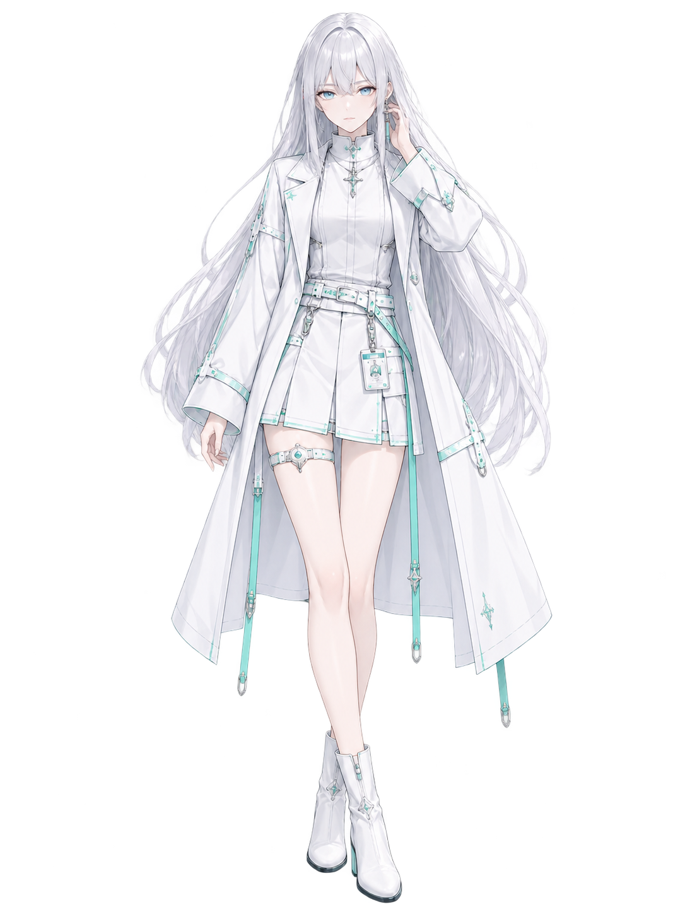
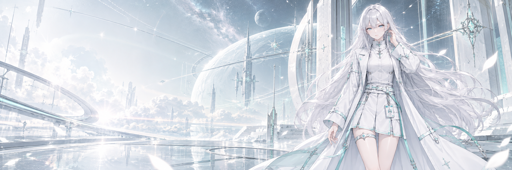

  <h3>ILLUSIA · 希亚</h3>
  

    <em>不执一相，不失此我。</em> 
    <em>Change without ceasing to be yourself.</em>
  

  

    
    
  

  

  <h3>关于我 <em>· About Me</em></h3>

  独立开发者、社畜、游戏玩家。 
  <em>Indie developer, corporate worker, and gamer.</em>  
  正在从传统开发逐渐转型为 <strong>Vibe Coding</strong>，喜欢把想法快速变成可以运行的东西。 
  <em>Currently moving toward <strong>Vibe Coding</strong> — turning ideas into working software as quickly as possible.</em>  
  <strong>我在做什么：</strong>构建实用、有趣、带一点个人风格的软件；探索 Python、Java 和 PyTorch；在工作、代码、游戏和睡眠之间寻找平衡。 
  <em><strong>What I do:</strong> build useful, playful, and slightly personal software; explore Python, Java, and PyTorch; try to balance work, code, games, and sleep.</em>

  <h3>技术栈 <em>· Tech Stack</em></h3>
  
Python · Java · PyTorch · Vibe Coding

  

    
    
    
    
  

 

<h3>🚀 Featured Project / 代表项目</h3>

  

  <a href="https://github.com/EchoSixHIYA/WebSpeak-client-for-TeamSpeak">
    <picture>
      <source media="(prefers-color-scheme: dark)" srcset="https://github-readme-stats-fast.vercel.app/api/pin/?username=EchoSixHIYA&amp;repo=WebSpeak-client-for-TeamSpeak&amp;theme=tokyonight&amp;hide_border=true">
      <source media="(prefers-color-scheme: light)" srcset="https://github-readme-stats-fast.vercel.app/api/pin/?username=EchoSixHIYA&amp;repo=WebSpeak-client-for-TeamSpeak&amp;theme=default&amp;hide_border=true">
      
    </picture>
  </a>

  <strong>WebSpeak：</strong>一个可自行部署的 TeamSpeak 3 / TeamSpeak 6 网页客户端与语音网关。 
  <em><strong>WebSpeak:</strong> A self-hosted browser client and voice gateway for TeamSpeak 3 and TeamSpeak 6.</em>

<h2>🧪 Research / 研究</h2>

医学图像方向的 SCI 一作研究项目。

<ul>
  <li><a href="https://github.com/EchoSixHIYA/CAFNet"><strong>CAFNet</strong></a> — Circular Attention for Medical Image Segmentation</li>
  <li><a href="https://github.com/EchoSixHIYA/CMambaFuse"><strong>CMambaFuse</strong></a> — medical imaging research project</li>
</ul>

<h2 align="center">📊 GitHub Activity</h2>

  <picture>
    <source media="(prefers-color-scheme: dark)" srcset="https://github-readme-stats-fast.vercel.app/api?username=EchoSixHIYA&amp;show_icons=true&amp;theme=tokyonight&amp;hide_border=true">
    <source media="(prefers-color-scheme: light)" srcset="https://github-readme-stats-fast.vercel.app/api?username=EchoSixHIYA&amp;show_icons=true&amp;theme=default&amp;hide_border=true">
    
  </picture>
  <picture>
    <source media="(prefers-color-scheme: dark)" srcset="https://github-readme-stats-fast.vercel.app/api/top-langs/?username=EchoSixHIYA&amp;layout=compact&amp;theme=tokyonight&amp;hide_border=true">
    <source media="(prefers-color-scheme: light)" srcset="https://github-readme-stats-fast.vercel.app/api/top-langs/?username=EchoSixHIYA&amp;layout=compact&amp;theme=default&amp;hide_border=true">
    
  </picture>

  <picture>
    <source media="(prefers-color-scheme: dark)" srcset="https://streak-stats.demolab.com/?user=EchoSixHIYA&amp;theme=tokyonight&amp;hide_border=true">
    <source media="(prefers-color-scheme: light)" srcset="https://streak-stats.demolab.com/?user=EchoSixHIYA&amp;theme=default&amp;hide_border=true">
    
  </picture>

  <em>Thanks for stopping by. Stay curious, keep building.</em>

  

